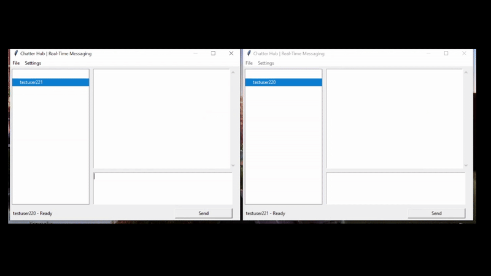

## :speech_balloon: CHATTER HUB

### :open_book: OVERVIEW
Date: March 2022\
Developer(s): Ashneet Rathore, Sachita Jnanesh Rayapati, Roselene Ujagar\
Based on assignment instructions from Prof. Mark S. Baldwin

Chatter Hub is a distributed social messenging application that allows users to send and receive messages through a DSU server. Users can create new profiles or load existing ones stored as .dsu files, add contacts, and chat with other users in real time.

### :classical_building: ARCHITECTURE
The application follows a client-server architecture implemented in **Python**. The frontend, built with **Tkinter**, provides an interactive GUI for composing, sending, and receiving messages. The backend uses **socket programming** to reliably send and receive messages over a TCP connection to the DSU server. All outgoing messages are encoded in **JSON** format before being sent.

### :open_file_folder: PROJECT FILE STRUCTURE
```bash
ChatterHub/
│── src/
│   │── main.py              # Starts Tkinter GUI and handles main app logic
│   │── profile.py           # Manages profile storage and loading
│   │── ds_messenger.py      # Handles messaging logic
│   └── ds_protocol.py       # Handles messaging protocol with JSON encoding and decoding
│── README.md                # Project documentation
│── .gitignore               # Specifies files and folders that shouldn't be included in the repo
└── demo.gif                 # GIF showing the message sending demo
```

### :rocket: CONFIGURATION
**1. Clone the repository**
```bash
git clone https://github.com/ashneetrathore/ChatterHub.git
cd ChatterHub/src
```
**2. Open ```main.py``` and set the `DSU_SERVER_ADD` variable the top of the file to a valid DSU server address**

**3. Open ```ds_messenger.py``` and set the `DSU_SERVER_PORT` variable the top of the file to a valid DSU server port**

**4. Run the application**
```bash
python main.py
```

### :wrench: TRY IT OUT
To test the functionality of the app, without needing multiple devices, you can simply act as 2 different users on the same device.
1. After running the application, click `File` in the menu bar.
2. Select `New` to create a new user profile.
3. When prompted, enter a username and click `OK`. For this scenario, let's say this profile username is **user1**.
4. When prompted, enter a password and click `OK`.
5. Choose a location to create and save a DSU file for this user and click `Save`.
6. Once the user is created, you should see the message "user1 - Ready" at the bottom left of the application.
7. To create a second user, open a second terminal, launch the application again, and repeat steps 1-6. Let's say this profile username is **user2**.

Next, add the other user as a contact in both users's apps.

8. In user1's app, click `Settings` in the menu bar.
9. Select `Add Contact`.
10. When prompted, enter **user2** and click `OK`.
11. In user2's app, repeat steps 8-10, entering **user1** as a contact.

Finally, send messages back and forth between the users.

12. In user1's app, select `user2` in the contact list. The selected contact should be highlighted in blue. Repeat the same step in user2's app, selecting `user1` as a contact.
13. Type a message in user1's app and click `Send`.
14. In user2's app, the message should appear. There may be a short delay.
15. Repeat this process in user2's app to send a message back to user1.

### :film_strip: DEMO
